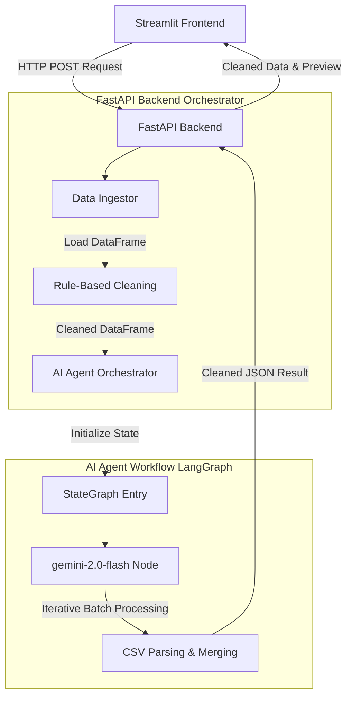

# 🧹 AI-Powered Data Cleaning & Preprocessing Agent

An intelligent, dual-layer data cleaning and preprocessing pipeline that combines traditional rule-based cleaning with agentic generative AI (Google Gemini 2.0 via LangGraph) to automatically ingest, clean, and normalize datasets from various sources.

This application provides a **FastAPI backend** that hosts the cleaning pipelines and a **Streamlit frontend** that allows users to clean data from uploaded CSV/Excel files, database queries, and live external APIs.

---

## 🚀 Setup & Installation

Follow these steps to set up the project locally on your system.

### Prerequisites

*   Python 3.10 or higher installed.
*   A Google Gemini API Key. You can get one from the [Google AI Studio](https://aistudio.google.com/).
*   *(Optional)* A running PostgreSQL database if you plan on testing database query ingestion.

### 1. Clone/Navigate to the Project
Open your terminal and navigate to the root directory of the project:
```bash
cd "AI Agent for Data Cleaning & Preprocessing"
```

### 2. Set Up a Virtual Environment
Create and activate a virtual environment to isolate the project dependencies:

*   **Windows (PowerShell)**:
    ```powershell
    python -m venv venv
    .\venv\Scripts\Activate.ps1
    ```
*   **macOS/Linux**:
    ```bash
    python3 -m venv venv
    source venv/bin/activate
    ```

### 3. Install Dependencies
Install all required libraries from the `requirements.txt` file:
```bash
pip install -r requirements.txt
```

### 4. Configure Environment Variables
1. Copy the `.env.example` file to a new file named `.env`:
   ```bash
   cp .env.example .env
   ```
2. Open the `.env` file and insert your Google Gemini API key:
   ```env
   GEMINI_API_KEY="your_actual_gemini_api_key_here"
   ```

---

## 🏃 How to Run the Project

The application runs as two separate services: a **Backend API Server (FastAPI)** and a **Frontend Web Application (Streamlit)**.

### Step 1: Start the FastAPI Backend
Run the FastAPI backend server to expose the API endpoints. In your active virtual environment terminal, execute:
```bash
python scripts/backend.py
```
*The server will start on `http://127.0.0.1:8000` with hot-reloading enabled.*

### Step 2: Start the Streamlit Frontend
Open a **new terminal window/tab**, activate your virtual environment, and launch the web interface:
```bash
streamlit run app/app.py
```
*Streamlit will automatically open a tab in your default web browser pointing to `http://localhost:8501`.*

---

## 🧪 Testing the Pipelines

### CLI Testing (End-to-End Pipeline)
To test the ingestion, cleaning, and AI processing pipeline directly from the command line without launching the web server, you can run the `main.py` test orchestrator:
```bash
python scripts/main.py
```
This script will:
1. Load and clean local CSV & Excel files in the `data/` folder.
2. Query a local database (if configured).
3. Fetch data from a placeholder API and process it.

### Database Connection Testing
To check if your credentials can successfully connect to your local PostgreSQL database instance:
```bash
python scripts/test_postgres_connection.py
```

---

## 🌟 Key Features

*   **Multi-Source Data Ingestion**:
    *   **Files**: Support for CSV (`.csv`) and Excel (`.xlsx`) formats.
    *   **Databases**: Execute custom SQL queries directly against relational databases (e.g., PostgreSQL).
    *   **APIs**: Ingest data from external REST endpoints, with automatic normalization of nested JSON structures.
*   **Dual-Layer Data Cleaning Engine**:
    *   **Layer 1: Rule-Based Cleaning**:
        *   Automatic imputation of numeric missing values (mean strategy).
        *   Categorical missing values imputed with mode or fallback values.
        *   Identification and removal of duplicate rows.
        *   Auto-inference and conversion of data types.
    *   **Layer 2: AI-Powered Cleaning**:
        *   Driven by `gemini-2.0-flash` model.
        *   Orchestrated via a LangGraph state graph workflow (`StateGraph`).
        *   Batched data processing to optimize token usage and context limits.
        *   Automatic fallback to rule-based data if AI output is malformed or times out.
*   **Interactive Web Interface**: A clean, modern Streamlit UI displaying raw data previews, cleaning progress, and side-by-side comparison tables.
*   **Decoupled Architecture**: Independent FastAPI backend service, allowing integration into other pipelines or custom scripts.

---

## 📐 System Architecture



---

## 📂 Project Structure

```text
├── .env                       # Local environment credentials (API keys)
├── .env.example               # Reference template for environment variables
├── .gitignore                 # Files/folders excluded from git tracking
├── requirements.txt           # Python library dependencies
├── app/
│   └── app.py                 # Streamlit frontend application
├── data/                      # Directory for local datasets
│   ├── sample2.csv
│   ├── sample_data.csv
│   └── sample_data.xlsx
└── scripts/
    ├── __pycache__/
    ├── ai_agent.py            # LangGraph state machine & Google Gemini client
    ├── backend.py             # FastAPI API endpoints & pipeline coordinator
    ├── data_cleaning.py       # Imputation, deduplication, and parsing logic
    ├── data_ingestions.py     # API, DB, CSV, Excel ingestion helper classes
    ├── main.py                # Command-line integration test script
    └── test_postgres_connection.py  # Script to test connection to PostgreSQL
```

---

## 🛠️ Customization & Extensibility

*   **AI Cleaning Model/Rules**: You can modify the system instructions and constraints sent to the AI in [ai_agent.py](file:///c:/Users/araj1/OneDrive/Desktop/AI%20Agent%20for%20Data%20Cleaning%20&%20Preprocessing/scripts/ai_agent.py).
*   **Rule-Based Imputation Strategy**: Change the default behavior for missing value imputations in [data_cleaning.py](file:///c:/Users/araj1/OneDrive/Desktop/AI%20Agent%20for%20Data%20Cleaning%20&%20Preprocessing/scripts/data_cleaning.py).
*   **Batch Sizing**: Adjust the `batch_size` parameter in `AIAgent.process_data` in [ai_agent.py](file:///c:/Users/araj1/OneDrive/Desktop/AI%20Agent%20for%20Data%20Cleaning%20&%20Preprocessing/scripts/ai_agent.py) to control how many rows are sent to Gemini in a single request.
